# dsh-diff-card

[中文](README.md) | English

<p align="center">
  <picture>
    <source media="(prefers-color-scheme: dark)" srcset="docs/banner-dark.svg">
    
  </picture>
</p>

[](https://awesome-dsh-plugin.com)
[](https://www.npmjs.com/package/dsh-diff-card)
[](LICENSE)

File-change card for [DSH Desktop](https://github.com/anywhere-labs/dsh-desktop). After the agent edits files, tool rows show **+N −M**, a per-turn list appears, and you can review aligned diffs on click. Open files with the system app, Finder/Explorer, or VS Code on macOS and Windows.

<p align="center">
  
</p>

## Features

- **+N −M** on edit / write rows
- Per-turn card “Edited N files”, 3-file preview, header total `+xx −xx`
- Click a row to expand or collapse that file’s diff
- **View changes**: expand every file and its diff; click again to collapse
- **Review**: expand every diff in the turn
- **Undo**: restore this turn’s files (refuses if they changed elsewhere)
- Row **▾**: open with system, show in folder, VS Code, copy absolute / relative path
- Covers `edit`, `write`, `str_replace_editor`, and Code Dispatch sub-calls
- Copy follows the UI language (zh / en)

## Screenshots

| Turn card | Row badge and diff |
| --- | --- |
|  |  |

## Install

```sh
dsh plugin --profile desktop add dsh-diff-card
```

Refresh the web GUI or restart DSH Desktop. Requires DeepSeek Harness `>= 0.1.2-rc.1`.

From source:

```sh
git clone https://github.com/WongYuYe/dsh-diff-card.git
cd dsh-diff-card
pnpm install
dsh plugin --profile desktop add .
```

## Development

```sh
pnpm install
pnpm build
pnpm typecheck
pnpm check:align
pnpm check:join
```

Release: bump `package.json` to `X.Y.Z` and push a `vX.Y.Z` tag. GitHub Actions opens the Release and publishes to npm when Trusted Publisher is bound.

## License

MIT
