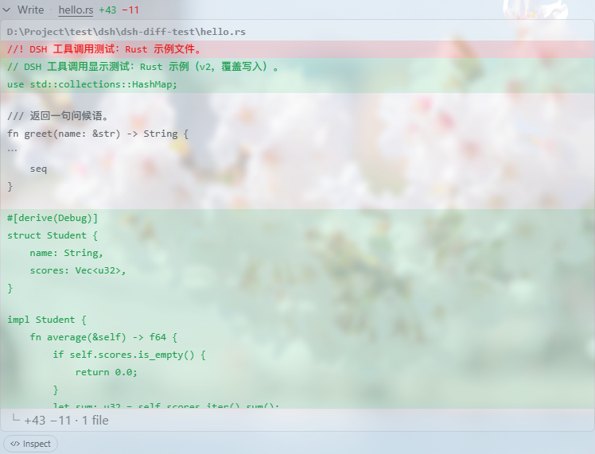

# DSH Diff Card

中文 | [English](README.en.md)

<p align="center">
  <picture>
    <source media="(prefers-color-scheme: dark)" srcset="docs/banner-zh-dark.svg">
    
  </picture>
</p>

[](https://awesome-dsh-plugin.com)
[](https://github.com/deepseek-ai/deepseek-harness)
[](https://www.npmjs.com/package/dsh-diff-card) [](https://www.npmjs.com/package/dsh-diff-card)
[](https://github.com/deepseek-ai/deepseek-harness)

[](LICENSE)

[](https://github.com/WongYuYe/dsh-diff-card/graphs/commit-activity)
[](https://github.com/WongYuYe/dsh-diff-card/commits)

[DeepSeek Harness](https://github.com/deepseek-ai/deepseek-harness) Web 插件，将智能体的文件变更可视化：变更工具行内联 **+N −M** 徽标、轮末文件变更汇总卡、点击展开对齐后的完整 diff。原生 `edit`/`write` 调用、极简预设的 `str_replace_editor`、Code Dispatch（PTC）子调用全链路覆盖。不依赖 git，不依赖任何第三方插件。

<p align="center">
  
</p>

## 功能

- **内核目标：harness ≥ 0.1.2-rc.1** — 单一构建面向现行 rc 产线：`uiConversation` 事件注册表、`tool.call.toolview` keyed 槽与 `conversation.chat.turnTail` 链均为 `0.1.2-rc.1+` 形态，diff hunk 读自工具持久化的 wire `meta`。
- **行内 +N −M 徽标** — 接管 `edit`、`write` 与 `str_replace_editor` 的 stock 变更行（keyed 低优先阴影，卸载自动还原）。计数是真实变更行数——与 diff 渲染共用同一趟 LCS：运行中按参数预估，结算后取精确值
- **对齐 diff 窗口** — 点击行展开限高滚动的 unified 视图。两侧先做行级 LCS 对齐：共同行渲染为变更处 ±3 行上下文，更远的未变更区间折叠为 ⋯；页脚统计与正文渲染完全同源
- **行号槽** — 文件视图按 1..N 编号；diff 窗口把每个 hunk 钉到当前文件中的真实位置（一次缓存围栏读取、唯一性校验）：删除行读旧侧号码、上下文/新增行读新侧号码，变更行带左缘色条；无法定位的 hunk（host 缺席、文件已再改动、超预算）退回窗口内 1..N 相对编号，行号槽始终渲染
- **轮末汇总卡** — Codex 风格「已编辑 N 个文件」卡片，含查看更改 / 撤销 / 审核、默认预览 3 个文件、完整相对路径与 +n −m；同文件多次编辑按结算顺序合并累计
- **Code Dispatch（PTC）全链路** — dispatch 子调用在 wire 上没有 diff 视图：行内回退到参数推导 diff，轮末卡从 stock 会话工具树 join 出其文件，纯 Code-Mode 轮同样有汇总卡；`subCallId` 去重防止重放双计
- **文件上下文增强** — 参数推导的裸片段在展开时获得至多 ±3 行真实文件上下文：增强器经 host 围栏 API 读取文件、定位片段的 after 形态并重建 hunk（尽力而为；无法定位的片段保持原样）
- **撤销** — 一键把本轮文件恢复到轮前状态：hunk 链倒序唯一性回剥、轮首快照证明文件为「本轮新建」（而非覆盖）后才删除、文件漂移在写入前拒绝、原子提交
- **内嵌查看与打开系** — 点「打开」用系统默认应用打开文件（macOS `open` / Windows 默认关联）；「▾」菜单提供内嵌预览、在文件夹中显示（Finder / 资源管理器）、VS Code 与绝对/相对路径复制
- **毛玻璃（可选）** — 安装 [deepseek-harness-background](https://github.com/HaoyueQin/deepseek-harness-background) 后，本插件全部表面并入其共享玻璃配方；未安装时保持 stock 不透明外观——优雅降级、零新增第三方运行时（peer 模块由 harness 提供）
- **中英文** — 文案跟随 Web 界面语言（locale 服务）

## 截图

| 轮末汇总卡 | 接管行与对齐 diff |
| --- | --- |
|  |  |

左：轮末汇总卡，含逐文件审查 / 打开 / 撤销操作；右：行内 +N −M 徽标与其对齐 diff 窗口。均处于可选毛玻璃效果之下。

## 机制

- **徽标与 diff**：注册进 `tool.call.toolview` keyed 槽的 `edit`/`write`/`str_replace_editor` 键，priority −1 阴影 shipped 行；diff 数据按权威链提取：工具持久化的 wire meta（含 ±3 行文件上下文），PTC 子调用回退到调用时参数推导——窗口截断丢掉调用头时仍可从 result meta 渲染
- **轮末汇总卡**：`ConversationNodeDefinition` 聚合器（`turn/start`、`tool/call`、`tool/result(append)`、`tool/code-dispatch`）发布 Turn 数据，`conversation.chat.turnTail` 链认领渲染——结构遵循官方 `ui-deliverables` 模式。Code-Dispatch 文件从 stock 会话工具树 join：其 `tool-call` 节点已把每个 dispatch 按 rootCallId 折叠进根调用的 `subCalls`
- **上下文增强**：参数来源的 hunk 在构造时按对象身份标记；展开时增强器经围栏 API 读取文件（LRU 缓存）、定位片段的 after 形态并以共享行重建 hunk，无法定位的原样渲染
- **host 半**（可选）：同源前缀路由提供围栏 API（files.read、每轮快照 capture、undo、open-with）——realpath 包含性解析前后双查、符号链接拒绝、UTF-8 回环校验、显示读取 512 KiB 上限并带截断标记、undo 32 MiB 门限、原子写；host 半缺席时相关操作自动隐藏
- **毛玻璃桥**（可选）：零依赖消费 background 插件的 `window.__DSH_BACKGROUND_GLASS__` 注册表——常驻订阅其 ready 事件（覆盖两种到达顺序与热重载）；桥不存在时普通界面原样保留

## 安装

```sh
dsh plugin --profile desktop add /Users/wyuye/Works/dsh-diff-card
```

## 开发

```sh
pnpm install        # devDependencies；prepare 会自动构建 lib/
pnpm build          # host 半 → lib/index.js + 浏览器半 → lib/client.js（一次 tsdown）
pnpm typecheck      # 双端 tsc
pnpm check:align    # 对齐引擎与数据模型断言（需 Node >= 23.6）
```

> **内核兼容性：** 本构建面向 harness `>= 0.1.2-rc.1`。打开文件同时支持 macOS 与 Windows。
>
> **发布：** 把 `package.json` 版本改成 `X.Y.Z` 后推 `vX.Y.Z` tag。GitHub Actions 会打 GitHub Release 并用 Trusted Publisher（OIDC）发到 npm，本机不用再输 2FA。

基于 [HaoyueQin/dsh-diff-stat](https://github.com/HaoyueQin/dsh-diff-stat) 增加跨平台打开。

## License

MIT
